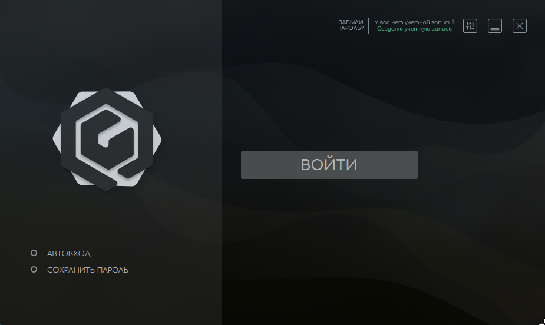
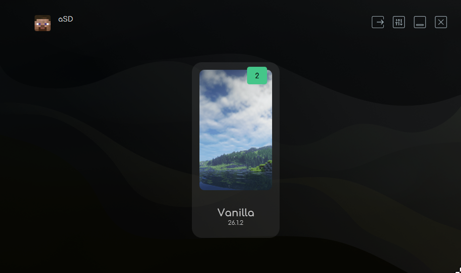
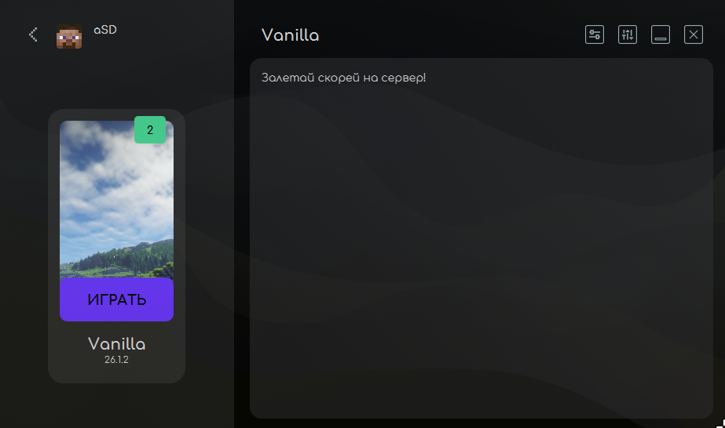

## Как начать играть

### 1. Скачай лаунчер по ссылке 

Скачай файл **Launcher SibirHouse.exe** (Подходит только под Windows!):

[Скачать Launcher SibirHouse.exe](https://files.sibihouse.ru/Launcher_SibirHouse.exe)

Скачай файл **Launcher SibirHouse.jar** (Linux/Windows, всё где есть Java):

[Скачать Launcher SibirHouse.jar](https://files.sibihouse.ru/Launcher_SibirHouse.jar)

> VirusTotal проверил данные файлы на наличие вирусов!

Launcher.exe:
https://www.virustotal.com/gui/file/7b2a411080f3f5f2d09a96f06f48926f7ddff1249a040d13a25bc2be607561da?nocache=1

Launcher.jar:
https://www.virustotal.com/gui/file/3a56c5120da34ca8cd490bdeb50ec585dba3345a9143118fce5f9c1b90925203?nocache=1

### 2. Запусти лаунчер
1. Запусти скачанный файл `Launcher SibirHouse.exe`.
2. Появится небольшое окно загрузки.
3. Подожди, пока Prestarter скачает всё необходимое (Java + лаунчер). В первый раз это может занять 1–15 минут (зависит от скорости интернета).

После завершения загрузки **Prestarter автоматически запустит основной лаунчер**.

### 3. Введи никнейм в лаунчере
Откроется окно **SibiHouse Launcher**. В нём нужно ввести данные для входа:

- В поле **Логин** введи свой игровой ник (английские буквы и цифры).
- Нажми кнопку **Войти**.

### 4. Как начать играть
После входа ты попадёшь в главное меню лаунчера:

1. Выбери нужный сервер (Vanilla).

2. Нажми большую кнопку **Играть** внизу экрана.

Minecraft запустится и в списке серверов уже будет ждать наш сервер.

## Полезные советы

- **Первый запуск** может занять больше времени — лаунчер скачивает файлы игры.
- Если лаунчер не запускается после Prestarter — попробуй запустить `Launcher SibiHouse.exe` ещё раз.

## Не получается зайти?

Напиши нам в [Telegram](https://t.me/oaegvkl) и опиши, на каком шаге возникла проблема.
