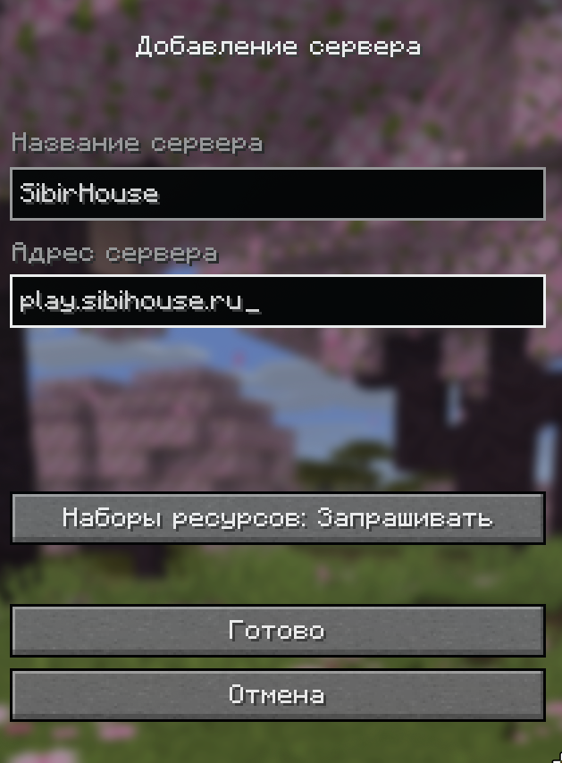
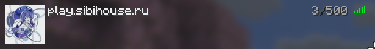

### Как начать играть на проекте SibirHouse

Перед началом обязательно прочитайте **Правила** и **Информацию** в нашем [Telegram-канале](https://t.me/+7pMP_nVje_hkOGE6).

### Первое — с чего начать?

1. Присоединиться к чату [Telegram](https://t.me/+7pMP_nVje_hkOGE6).
2. Написать в чат `/whitelist` и ваш ник.
3. Если даёт выбор платформы — выбрать нужную.

### Второе — как зайти?

1. Найти нужную версию можно в том же Telegram-канале, к которому вы присоединились.
2. Запустите игру нужной версии и добавьте сервер в список серверов.

### Команды авторизации

<table>
    <thead>
    <tr>
        <th>Команда</th>
        <th>Назначение</th>
    </tr>
    </thead>
    <tbody>
    <tr>
        <td><code>/register</code></td>
        <td>Регистрация аккаунта</td>
    </tr>
    <tr>
        <td><code>/login</code></td>
        <td>Вход в аккаунт</td>
    </tr>
    </tbody>
</table>

3. Вас перекинет на сервер, где уже можно играть.
4. Если пишет, что вас нет в вайтлисте (белом списке) — прочитайте начало этой инструкции.

### Приятной игры! 🎮
