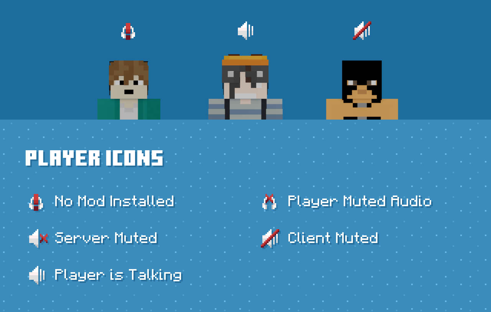
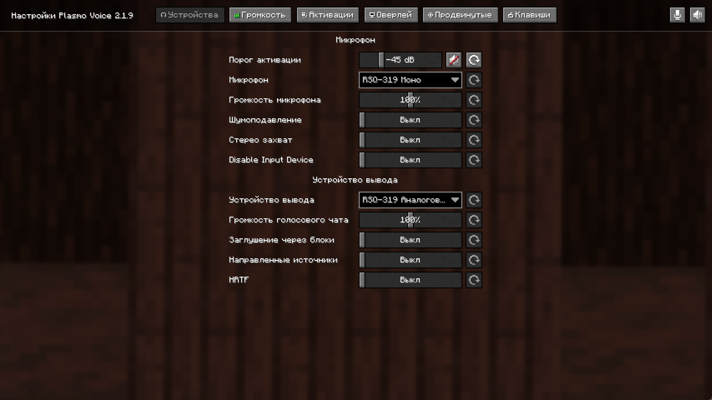

## Установка

1. Скачайте мод **Plasmo Voice**.
2. Поместите его в папку с модами (`mods`).
3. Запустите игру — голосовой чат готов к использованию.

### Скачать Plasmo Voice
[Скачать мод (Fabric)](https://modrinth.com/plugin/plasmo-voice/versions?l=fabric)

## Иконки

## Интерфейс

Открыть окно голосового чата можно клавишей <kbd>V</kbd>.

Через это меню вы можете:
- Открыть настройки голосового чата
- Включить/выключить микрофон
- Полностью отключить голосовой чат
- Настроить громкость отдельных игроков
- Настроить громкость проигрывателей музыки

## Полезные аддоны

### SoundPhysics
[Скачать](https://modrinth.com/mod/pv-addon-soundphysics)  
Добавляет реалистичную физику звука (эхо, затухание, отражения и т.д.).

### Talking Heads
[Скачать](https://modrinth.com/mod/talkingheads)  
Во время разговора голова игрока начинает двигаться, что делает общение более живым.

